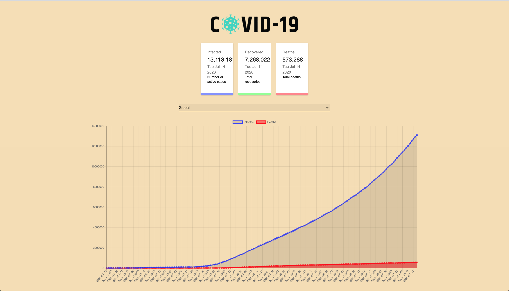

# COVID-19 Tracker

[](https://www.facebook.com/sharer/sharer.php?u=https://github.com/muhammadaltaf/COVID19) [](https://twitter.com/intent/tweet?source=https://github.com/muhammadaltaf/COVID19&text=COVID%2019%20Tracker:%20https://github.com/muhammadaltaf/COVID19) [](http://pinterest.com/pin/create/button/?url=https://github.com/muhammadaltaf/COVID19&description=Covid%2019%20Tracker) [](http://www.reddit.com/submit?url=https://github.com/muhammadaltaf/COVID19) [](http://www.linkedin.com/shareArticle?mini=true&url=https://github.com/muhammadaltaf/COVID19&title=Covid%2019%20Tracker&summary=Covid%2019%20Tracker&source=https://github.com/muhammadaltaf/COVID19) [](http://wordpress.com/press-this.php?u=https://github.com/muhammadaltaf/COVID19&s=.) [](mailto:?subject=Covid%2019%20Tracker&body=Covid%2019%20Tracker:%20https://github.com/muhammadaltaf/COVID19)

## How to run

```
$ npm install
$ npm start
```

## Previews




API: [Covid19 Mathdro](https://covid19.mathdro.id/api)
